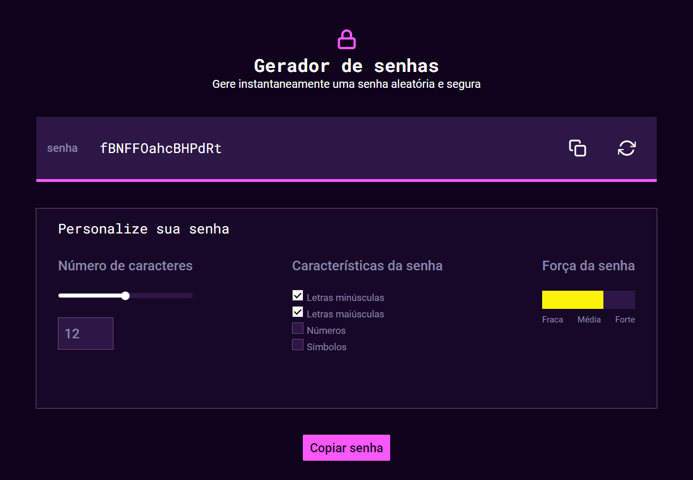
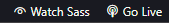

<h1 align="center" style="font-weight: bold;">Gerador de Senha 💻</h1>

<p align="center">
 <a href="#tech">Tecnologias</a> • 
 <a href="#started">Comece por aqui</a> • 
</p>

<p align="center">
    <b>Desenvolvi um projeto de front-end que gera senhas aleatórias usando HTML, CSS, e JavaScript. O aplicativo permite ao usuário escolher o comprimento da senha e incluir ou excluir caracteres especiais, números e letras maiúsculas. A interface é intuitiva, com um design responsivo que funciona bem em dispositivos móveis. O código foi organizado para facilitar futuras melhorias e personalizações. A aplicação foi implementada com foco na segurança e na usabilidade.</b>
</p>

<p align="center">
     <a href="https://beabiz.github.io/gerador-de-senha">📱Visite meu projeto</a>
</p>

<h2 id="layout">🎨 Layout</h2>

<p align="center">
    
</p>

<h2 id="technologies">💻 Tecnologias </h2>

- HTML
- SASS / CSS
- JavaScript

<h2 id="started">🚀 Comece por aqui </h2>

<h3>Pré-requisitos</h3>

Uma lista de todos os pré-requisitos necessários para rodar o meu projeto:

- [VScode](https://code.visualstudio.com/)
- [Live Server](https://marketplace.visualstudio.com/items?itemName=ritwickdey.LiveServer)
- [Live Sass Compiler](https://marketplace.visualstudio.com/items?itemName=glenn2223.live-sass)


<h3>Clone</h3>

Você pode clonar com o comando abaixo: 
```bash
git clone https://github.com/beabiz/gerador-de-senha.git
```

<h3>Rodando o Projeto</h3>

Ao abrir o VScode, já com as extensões instaladas, basta clicar nos botões para startar o projeto em HTML e o pré-processamento do SASS


